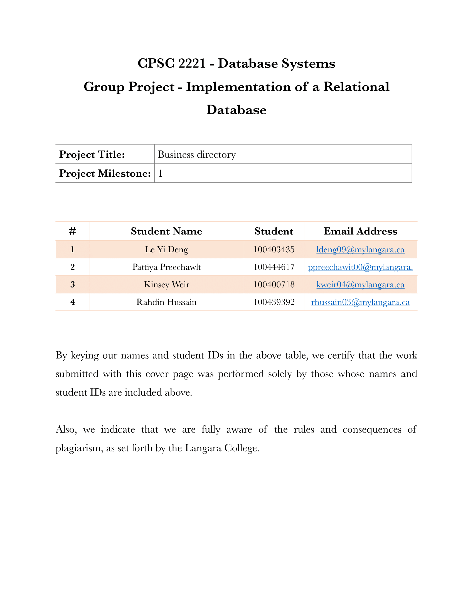
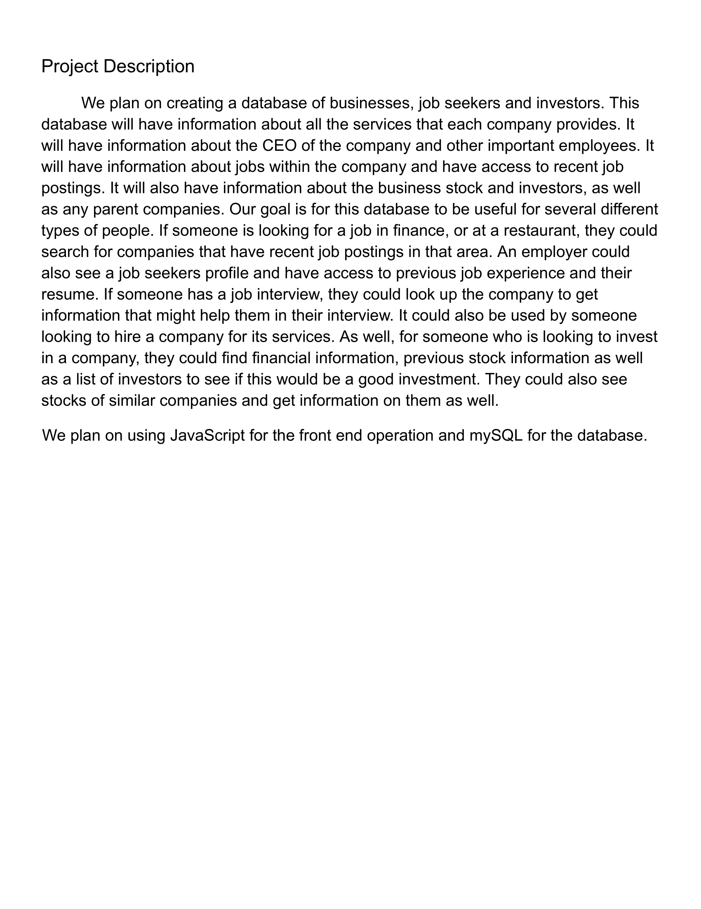
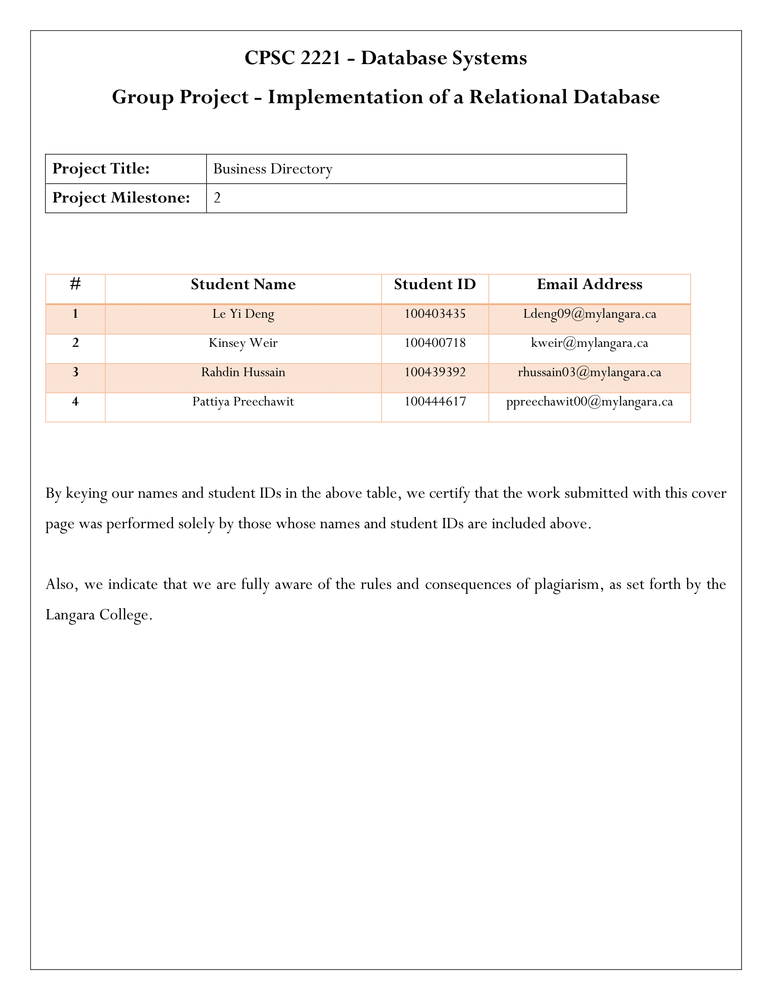
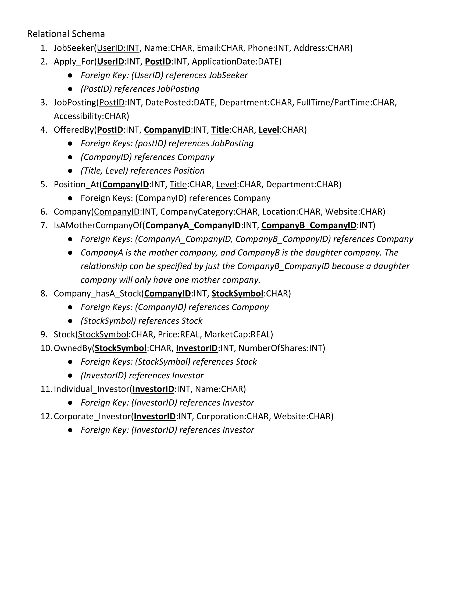
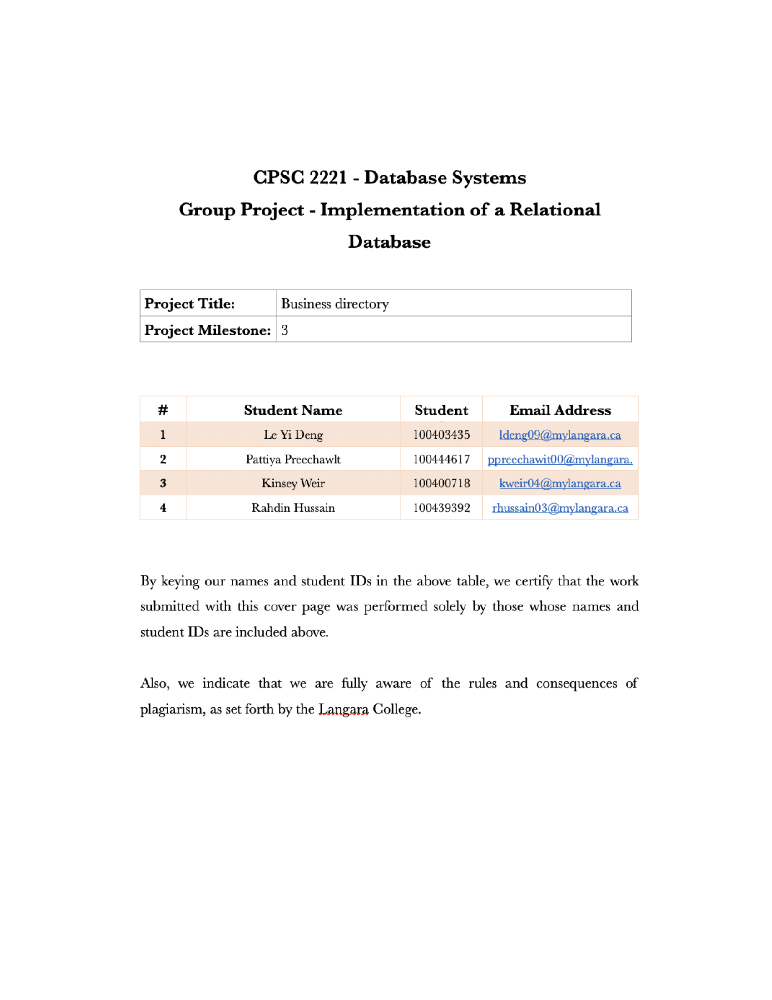
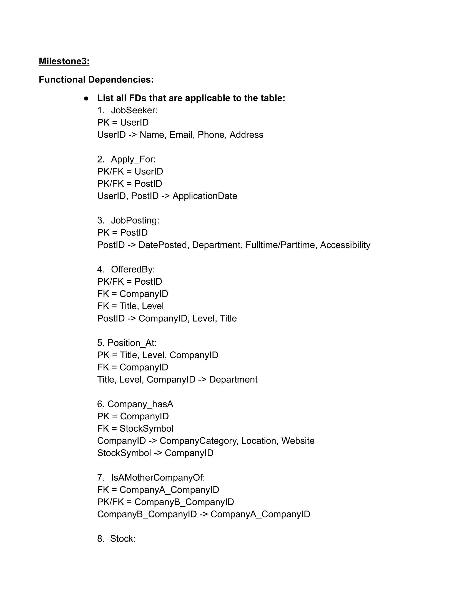
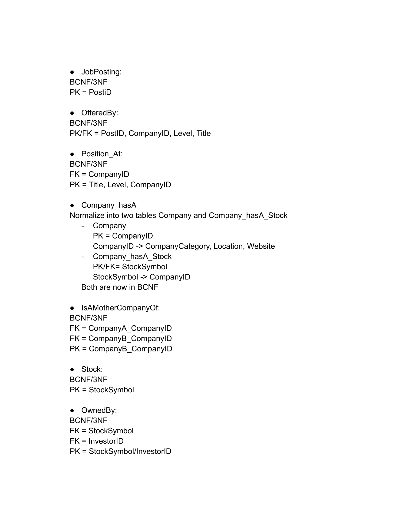

# Business Directory – CPSC 2221 Group Project

**Live Demo**: [https://business-directory.vercel.app](https://business-directory.vercel.app)  
**GitHub**: [github.com/rahdinhussain/business-directory](https://github.com/rahdinhussain/business-directory)  
**Team**: Le Yi Deng, Pattiya Preechawit, Kinsey Weir, **Rahdin Hussain**

---

## Documentation

### Milestone 1 – Cover Page


### Project Description


### Milestone 2 – Cover Page


### ERD


### Relational Schema


### Milestone 3 – Cover Page


### Functional Dependencies


### Normalization (Page 1)


### Normalization (Page 2)


---

## How to Run Locally
```bash
git clone https://github.com/rahdinhussain/business-directory.git
cd business-directory
npm install
node init-db.js
node index.js